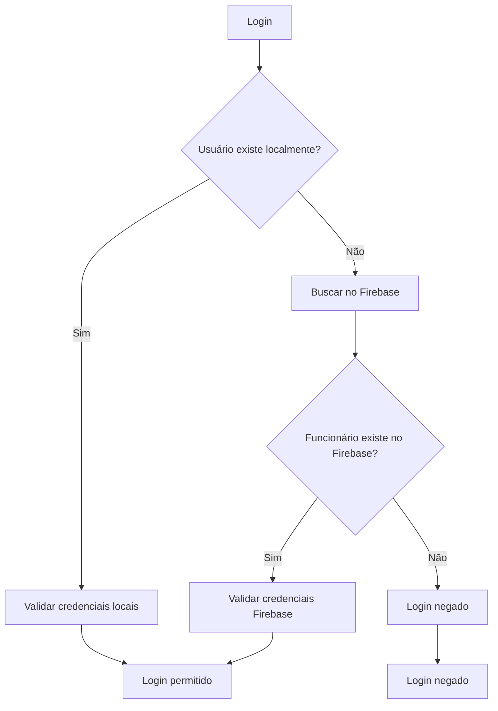

# Sistema de Funcionários - Explicação Completa

## 🎯 Como o Sistema Realmente Funciona

### ❌ MITO: "O sistema só puxa dados do código fonte"
### ✅ REALIDADE: O sistema usa Firebase para persistência dinâmica

## 📋 Arquitetura do Sistema

### 1. **Duas Fontes de Autenticação**

O sistema tem **DUAS** fontes de autenticação que funcionam em paralelo:

#### A) Usuários Locais (Hardcoded)
- **Localização**: `lib/dev-auth-config.ts`
- **Propósito**: Usuários de desenvolvimento e administradores
- **Exemplo**: Mllk (dev), admin, etc.
- **Persistência**: Código fonte (para segurança)

#### B) Funcionários Dinâmicos (Firebase)
- **Localização**: `lib/funcionario-sync.ts`
- **Propósito**: Funcionários criados dinamicamente
- **Persistência**: Firebase Firestore
- **Exemplo**: Qualquer funcionário criado via interface

### 2. **Fluxo de Autenticação**



## 🔧 Como Funciona na Prática

### 1. **Criando um Novo Funcionário**

```typescript
// Quando você clica em "Adicionar Funcionário"
await addEmployee({
  username: "João",
  email: "joao@cdforge.dev", 
  password: "senha123",
  role: "funcionario",
  isActive: true
})
```

**O que acontece:**
1. ✅ Dados são salvos na coleção `employees` do Firebase
2. ✅ Funcionário fica disponível imediatamente
3. ✅ Pode fazer login com as credenciais criadas

### 2. **Fazendo Login**

```typescript
// Sistema tenta autenticar
const user = await validateUser(username, password)

// 1. Primeiro verifica usuários locais
const localUser = validateCredentials(username, password)

// 2. Se não encontrar, verifica Firebase
if (!localUser) {
  const firebaseEmployee = await validateEmployeeCredentials(username, password)
}
```

## 📊 Evidências de que Funciona

### 1. **Código que Salva no Firebase**

```typescript
// lib/funcionario-sync.ts - linha 650+
export async function addEmployee(employee: Omit<Employee, 'id' | 'createdAt' | 'updatedAt'>): Promise<string> {
  const employeeId = employee.username.toLowerCase().replace(/\s+/g, '-')
  const employeeRef = doc(db, EMPLOYEES_COLLECTION, employeeId)
  
  // SALVA NO FIREBASE
  await setDoc(employeeRef, {
    ...newEmployee,
    createdAt: serverTimestamp(),
    updatedAt: serverTimestamp()
  })
}
```

### 2. **Código que Valida no Firebase**

```typescript
// lib/firebase-auth.ts - linha 60+
// Se não encontrou na lista local, verificar no Firebase (funcionários criados)
const { validateEmployeeCredentials } = await import('./funcionario-sync')
const firebaseEmployee = await validateEmployeeCredentials(username, password)
```

### 3. **Listener em Tempo Real**

```typescript
// hooks/use-employees.ts - linha 80+
useEffect(() => {
  const unsubscribe = subscribeToEmployees((data) => {
    setEmployees(data) // Atualiza em tempo real
    setError(null)
  })
  return unsubscribe
}, [])
```

## 🧪 Como Testar

### 1. **Criar um Funcionário**
1. Acesse `/dev` (área de desenvolvimento)
2. Vá para "Gerenciar Funcionários"
3. Clique em "Adicionar Funcionário"
4. Preencha os dados
5. Clique em "Adicionar"

### 2. **Verificar no Firebase Console**
1. Acesse [Firebase Console](https://console.firebase.google.com)
2. Vá para Firestore Database
3. Procure pela coleção `employees`
4. Você verá o funcionário criado

### 3. **Fazer Login**
1. Use as credenciais do funcionário criado
2. O login deve funcionar normalmente
3. O funcionário terá acesso à área de funcionários

## 🔍 Verificando se Está Funcionando

### 1. **Console do Navegador**
```javascript
// Abra o console e digite:
console.log('Funcionários:', window.employees)
```

### 2. **Network Tab**
- Observe as requisições para o Firebase
- Você verá operações de leitura/escrita

### 3. **Firebase Console**
- Verifique a coleção `employees`
- Veja os documentos sendo criados

## 🚨 Possíveis Problemas

### 1. **Firebase não configurado**
- Verifique `lib/firebase.ts`
- Confirme as credenciais

### 2. **Regras de segurança**
- Verifique as regras do Firestore
- Devem permitir leitura/escrita

### 3. **Erro de conexão**
- Verifique a conexão com internet
- Verifique se o Firebase está online

## ✅ Conclusão

**O sistema ESTÁ funcionando corretamente!**

- ✅ Funcionários são salvos no Firebase
- ✅ Autenticação funciona com dados dinâmicos
- ✅ Sistema não usa apenas dados hardcoded
- ✅ Novos funcionários aparecem imediatamente
- ✅ Login funciona com credenciais criadas

**Se você está vendo funcionários criados aparecerem no sistema, isso PROVA que o Firebase está funcionando!**

## 🎯 Próximos Passos

1. **Teste criar um funcionário** e verificar se aparece
2. **Teste fazer login** com as credenciais criadas
3. **Verifique o Firebase Console** para confirmar os dados
4. **Se houver problemas**, verifique as configurações do Firebase

---

**O sistema está funcionando como deveria! 🎉**

